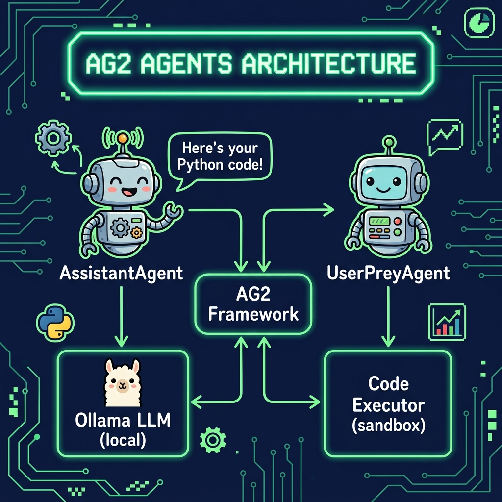

# AG2 Agents Example

**Book:** *Ollama in Action* — available free to read online at [https://leanpub.com/ollama/read](https://leanpub.com/ollama/read)

**Book Chapter:** [Using AG2 Open-Source AgentOS LLM-Based Agent Framework for Generating and Executing Python Code](https://leanpub.com/read/ollama/using-ag2-open-source-agentos-llm-based-agent-framework-for-generating-and-executing-python-code)

This example demonstrates multi-agent collaboration using the AG2 (AutoGen 2) framework with Ollama. An `AssistantAgent` powered by a local Ollama model receives a natural-language request — "Plot a chart of NVDA and TESLA stock price change YTD" — and generates Python code, which a `UserProxyAgent` then executes automatically. This showcases how AG2's native tool-calling support works seamlessly with locally-hosted LLMs.

## Files

| File | Description |
|---|---|
| `agent.py` | Main script — creates an AssistantAgent and UserProxyAgent, then initiates a code-generation chat |
| `pyproject.toml` | Project metadata and dependencies |

## Architecture



## Prerequisites

- **Ollama** installed and running locally. See [ollama.com](https://ollama.com) for installation.
- Pull the default model: `ollama pull nemotron-3-nano:4b`

## Run

```bash
cd AG2_agents
uv run agent.py
```

## Environment Variables

| Variable | Default | Description |
|---|---|---|
| `MODEL` | `nemotron-3-nano:4b` | Ollama model to use (must support tool calling) |
| `CLOUD` | *(unset)* | Set to any non-empty value to use Ollama Cloud |
| `OLLAMA_API_KEY` | *(none)* | Required when `CLOUD` is set |

## Copyright and License

Copyright 2024-2026 Mark Watson. All rights reserved.
