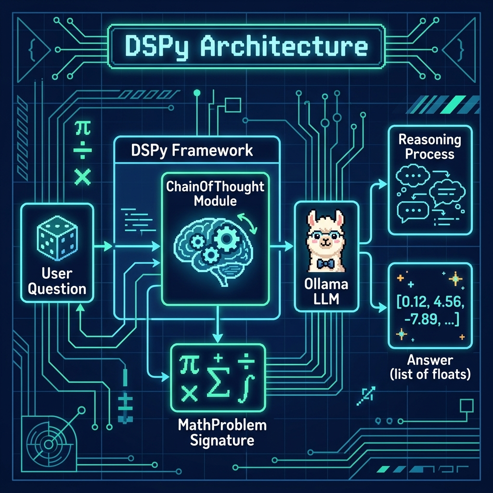

# DSPy Experiments

**Book:** *Ollama in Action* — available free to read online at [https://leanpub.com/ollama/read](https://leanpub.com/ollama/read)

**Book Chapter:** [DSP Experiments](https://leanpub.com/read/ollama/dsp-experiments)

This example uses the [DSPy](https://dspy.ai/) framework to create a structured chain-of-thought reasoning pipeline backed by a local Ollama model. The script defines a `ChainOfThought` signature that accepts a question and returns a list of floats along with step-by-step reasoning. The example asks a probability question ("Two dice are tossed — give me a list of the three most probable rolls") and displays both the model's reasoning process and its numeric answer.

## Files

| File | Description |
|---|---|
| `ollama_test.py` | Chain-of-thought math reasoning with DSPy and Ollama |
| `pyproject.toml` | Project metadata and dependencies |

## Architecture



## Prerequisites

- **Ollama** installed and running locally. See [ollama.com](https://ollama.com).
- Pull the default model: `ollama pull nemotron-3-nano:4b`

## Run

```bash
cd DSP
uv run ollama_test.py
```

### Example Output

```
Question: Two dice are tossed. Give me a list of the three most probable rolls.
Reasoning: When two dice are tossed, there are 36 possible outcomes. The sum
with the highest probability is 7 (6 combinations), followed by 6 and 8 (5 each).
Answer: [0.16666666666666666, 0.1388888888888889, 0.1388888888888889]
```

## Environment Variables

| Variable | Default | Description |
|---|---|---|
| `MODEL` | `nemotron-3-nano:4b` | Ollama model to use |
| `CLOUD` | *(unset)* | Set to any non-empty value to use Ollama Cloud |
| `OLLAMA_API_KEY` | *(none)* | Required when `CLOUD` is set |

## Copyright and License

Copyright 2024-2026 Mark Watson. All rights reserved.
