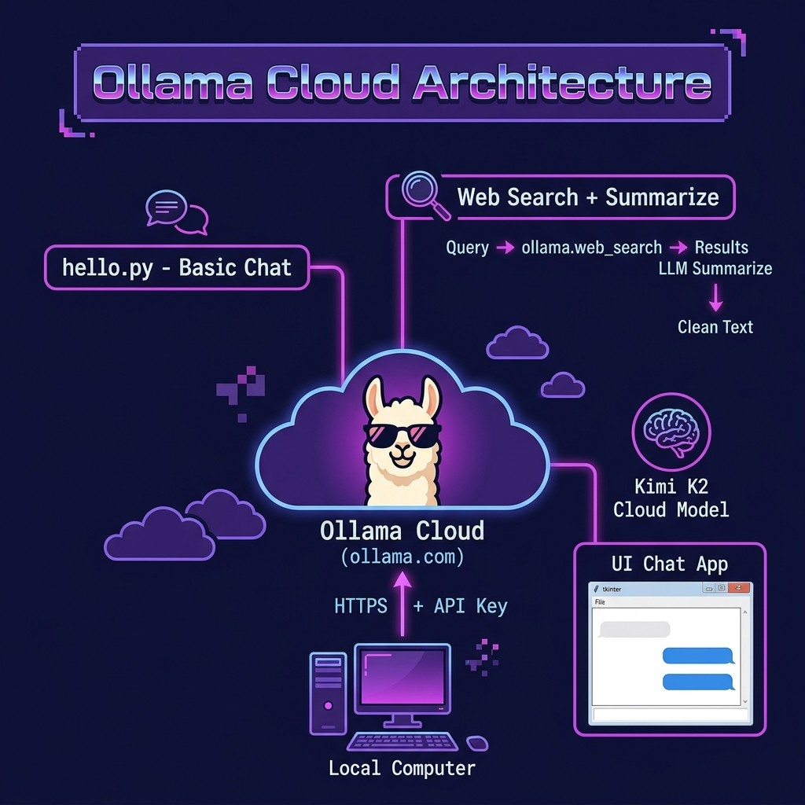

# Ollama Cloud Examples

**Book:** *Ollama in Action* — available free to read online at [https://leanpub.com/ollama/read](https://leanpub.com/ollama/read)

**Book Chapter:** [Using Ollama Cloud Services](https://leanpub.com/read/ollama/using-ollama-cloud-services)

These examples demonstrate how to use Ollama's cloud-hosted models via the Python SDK. Instead of running models locally, the scripts connect to `https://ollama.com` using an API key — useful for accessing large models (like Kimi K2) that may not fit on local hardware.

## Files

| File | Description |
|---|---|
| `hello.py` | Basic cloud chat — sends "Say 'hello' in three languages" to Ollama Cloud |
| `kimi-k2-1t-cloud.py` | Uses the Kimi K2 cloud model for multilingual greetings |
| `ollama_web_search.py` | Combines Ollama's `web_search` API with an LLM to search and summarize web results |
| `pyproject.toml` | Project metadata and dependencies |

## Architecture



## Prerequisites

- An **Ollama Cloud API key** — set via the `OLLAMA_API_KEY` environment variable.
- You can also try cloud models from the command line: `ollama run kimi-k2:1t-cloud`

## Run

```bash
cd OllamaCloud
export OLLAMA_API_KEY="your-key-here"
export CLOUD=1

uv run hello.py
uv run kimi-k2-1t-cloud.py
uv run ollama_web_search.py
```

## Environment Variables

| Variable | Default | Description |
|---|---|---|
| `MODEL` | `nemotron-3-nano:4b` | Ollama model to use |
| `CLOUD` | *(must be set)* | Enables Ollama Cloud mode |
| `OLLAMA_API_KEY` | *(required)* | Your Ollama Cloud API key |

## Copyright and License

Copyright 2024-2026 Mark Watson. All rights reserved.
