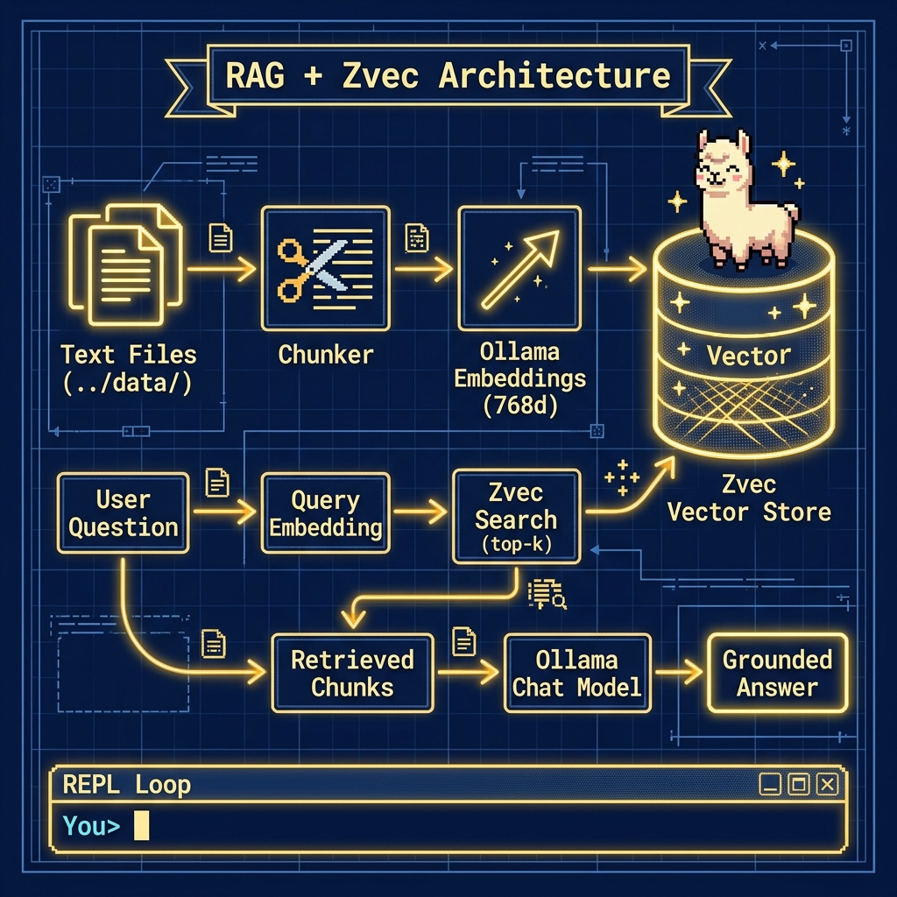

# RAG with Zvec Vector Store

**Book:** *Ollama in Action* — available free to read online at [https://leanpub.com/ollama/read](https://leanpub.com/ollama/read)

**Book Chapter:** [RAG Using zvec Vector Datastore and Local Model](https://leanpub.com/read/ollama/rag-using-zvec-vector-datastore-and-local-model)

This example implements a complete **Retrieval-Augmented Generation (RAG)** pipeline that runs entirely locally. It uses the [zvec](https://github.com/zacharycbrown/zvec) vector store to index text files, Ollama's embedding model (`embeddinggemma`) to generate 768-dimensional vectors, and a chat model to answer questions grounded in the retrieved context. The interactive REPL lets you ask natural-language questions about the indexed documents.

## Files

| File | Description |
|---|---|
| `app.py` | RAG pipeline — indexes text files from `../data/`, builds a zvec collection, then enters an interactive Q&A loop |
| `pyproject.toml` | Project metadata and dependencies |

## Architecture



## Prerequisites

- **Ollama** installed and running locally. See [ollama.com](https://ollama.com).
- Pull the embedding model: `ollama pull embeddinggemma`
- Pull the default chat model: `ollama pull nemotron-3-nano:4b`
- Text files to index should be placed in the `../data/` directory (a sample `economics.txt` is included).

## Run

```bash
cd RAG_zvec
uv run app.py
```

You will see an interactive prompt:

```
Building zvec index from text files …
Indexed 8 chunks from ../data

RAG chat ready  (model: nemotron-3-nano:4b)
Type your question, or 'quit' to exit.

You> What are the main schools of economic thought?
```

## Environment Variables

| Variable | Default | Description |
|---|---|---|
| `MODEL` | `nemotron-3-nano:4b` | Ollama chat model |
| `EMBEDDING_MODEL` | `embeddinggemma` | Ollama embedding model |
| `DATA_DIR` | `../data` | Directory containing `.txt` files to index |
| `CLOUD` | *(unset)* | Set to any non-empty value to use Ollama Cloud |
| `OLLAMA_API_KEY` | *(none)* | Required when `CLOUD` is set |

## Copyright and License

Copyright 2024-2026 Mark Watson. All rights reserved.
