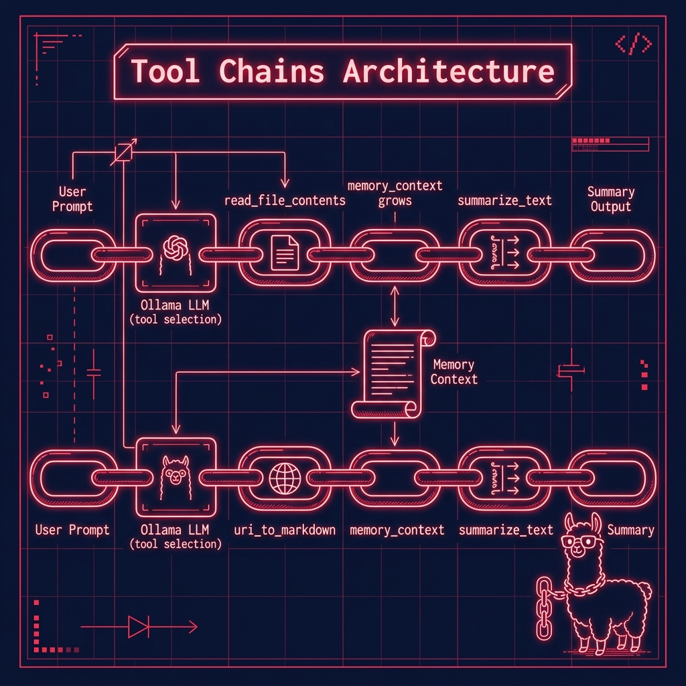

# Chains — Tool-Calling Demos

**Book:** *Ollama in Action* — available free to read online at [https://leanpub.com/ollama/read](https://leanpub.com/ollama/read)

**Book Chapter:** [LLM Tool Calling with Ollama](https://leanpub.com/read/ollama/llm-tool-calling-with-ollama)

These examples demonstrate **chaining multiple Ollama tool calls** together. The model receives a prompt, decides which tools to invoke (file reading, web fetching, summarization), executes them in sequence, and accumulates a "memory context" that grows across tool calls — a simple form of agentic reasoning.

## Files

| File | Description |
|---|---|
| `example_chain_read_summary.py` | Reads `../data/economics.txt` using the `read_file_contents` tool, then summarizes it with the `summarize_text` tool |
| `example_chain_web_summary.py` | Fetches a web page using `uri_to_markdown`, then summarizes the content |
| `pyproject.toml` | Project metadata and dependencies |

## Architecture



## Prerequisites

- **Ollama** installed and running locally. See [ollama.com](https://ollama.com).
- Pull a tool-calling-capable model: `ollama pull nemotron-3-nano:4b`
- The shared `tools/` library (in the parent `source-code/` directory) must be accessible.

## Run

```bash
cd chains
uv run example_chain_read_summary.py
uv run example_chain_web_summary.py
```

## Environment Variables

| Variable | Default | Description |
|---|---|---|
| `MODEL` | `nemotron-3-nano:4b` | Ollama model to use |
| `CLOUD` | *(unset)* | Set to any non-empty value to use Ollama Cloud |
| `OLLAMA_API_KEY` | *(none)* | Required when `CLOUD` is set |

## Copyright and License

Copyright 2024-2026 Mark Watson. All rights reserved.
