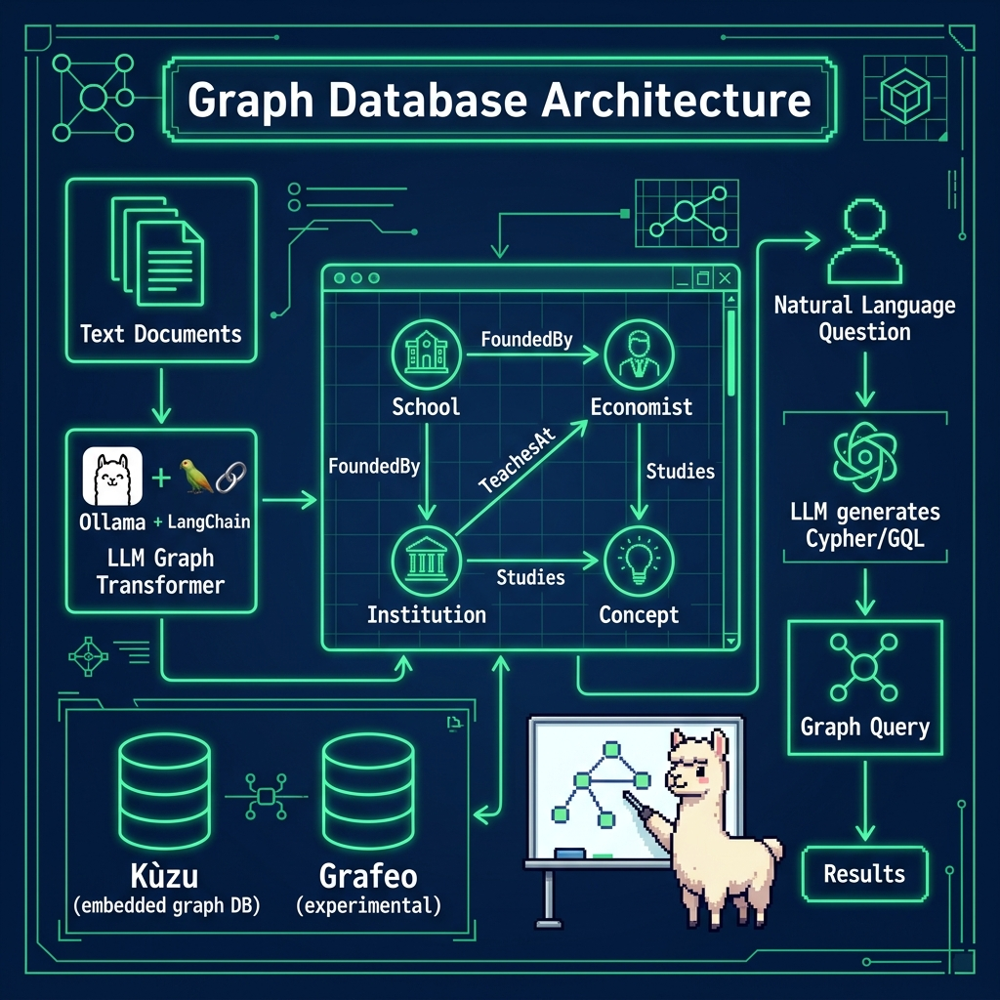

# Kùzu Graph Database Examples

**Book:** *Ollama in Action* — available free to read online at [https://leanpub.com/ollama/read](https://leanpub.com/ollama/read)

**Book Chapter:** [Using Property Graph Database with Ollama](https://leanpub.com/read/ollama/using-property-graph-database-with-ollama)

These examples show how to combine Ollama with the [Kùzu](https://kuzudb.com/) embedded property graph database. One script uses Ollama (via LangChain's `KuzuQAChain`) to answer natural-language questions about a movie/actor graph by generating and executing Cypher queries. The other builds a graph schema from an economics text and runs pre-defined Cypher queries against it.

## Files

| File | Description |
|---|---|
| `graph_kuzu_property_example.py` | Builds a movie/actor graph in Kùzu, then uses LangChain's `KuzuQAChain` with Ollama to answer questions in natural language |
| `graph_kuzu_from_text.py` | Creates a graph schema (Schools, Economists, Institutions, Concepts) from `../data/economics.txt` and runs sample Cypher queries |
| `grafeo-langchain-test.py` | **Experimental** — tests the Grafeo graph database with LangChain (not covered in the book) |
| `pyproject.toml` | Project metadata and dependencies |

## Architecture



## Prerequisites

- **Ollama** installed and running locally. See [ollama.com](https://ollama.com).
- Pull the default model: `ollama pull nemotron-3-nano:4b`
- For the Grafeo experiment: `ollama pull nomic-embed-text`

## Run

```bash
cd graph
uv run graph_kuzu_property_example.py
uv run graph_kuzu_from_text.py
```

> **Note:** Each run creates a local database directory (`test_db` or `economics_db`). Delete these directories to start fresh.

## Environment Variables

| Variable | Default | Description |
|---|---|---|
| `MODEL` | `nemotron-3-nano:4b` | Ollama model to use |
| `CLOUD` | *(unset)* | Set to any non-empty value to use Ollama Cloud |
| `OLLAMA_API_KEY` | *(none)* | Required when `CLOUD` is set |

## Copyright and License

Copyright 2024-2026 Mark Watson. All rights reserved.
