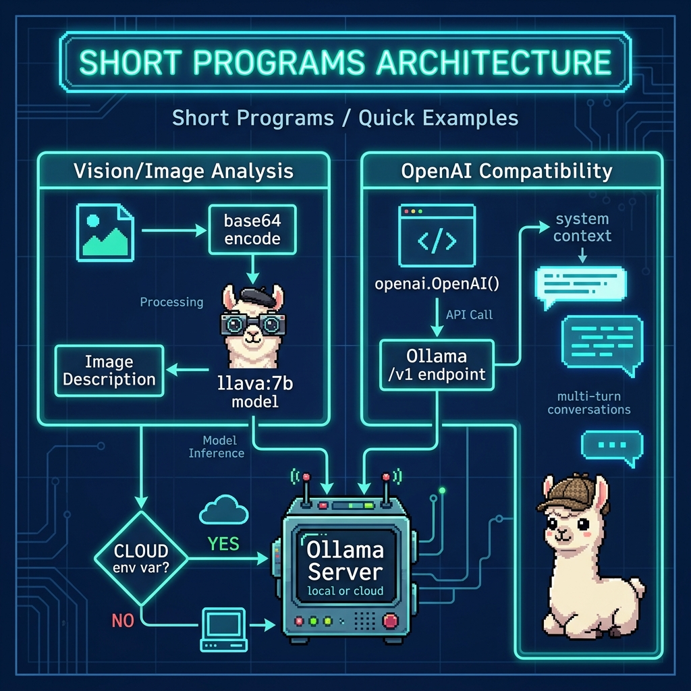

# Short Programs / Quick Examples

**Book:** *Ollama in Action* — available free to read online at [https://leanpub.com/ollama/read](https://leanpub.com/ollama/read)

**Book Chapter:** [Short Examples](https://leanpub.com/read/ollama/short-examples)

Short, self-contained scripts that demonstrate core Ollama features without additional frameworks.

## Files

| File | Description |
|---|---|
| `Ollama_sdk_image_example.py` | Analyzes an image using Ollama's multimodal/vision API (requires a vision model like `llava:7b`) |
| `OpenAI_compatibility_example.py` | Uses the OpenAI Python SDK to talk to Ollama via its OpenAI-compatible `/v1` endpoint — demonstrates single-shot and multi-turn conversation |

## Architecture



## Prerequisites

- **Ollama** installed and running locally. See [ollama.com](https://ollama.com).
- For the image example: `ollama pull llava:7b` (or another vision model)
- For the OpenAI compatibility example: `ollama pull nemotron-3-nano:4b`
- A sample image is provided at `../data/sample.jpg`.

## Run

```bash
cd short_programs
uv run OpenAI_compatibility_example.py
uv run Ollama_sdk_image_example.py
```

## Environment Variables

| Variable | Default | Description |
|---|---|---|
| `MODEL` | `nemotron-3-nano:4b` | Ollama model (image example defaults to `llava:7b` unless `MODEL` is set) |
| `CLOUD` | *(unset)* | Set to any non-empty value to use Ollama Cloud |
| `OLLAMA_API_KEY` | *(none)* | Required when `CLOUD` is set |

## Copyright and License

Copyright 2024-2026 Mark Watson. All rights reserved.
