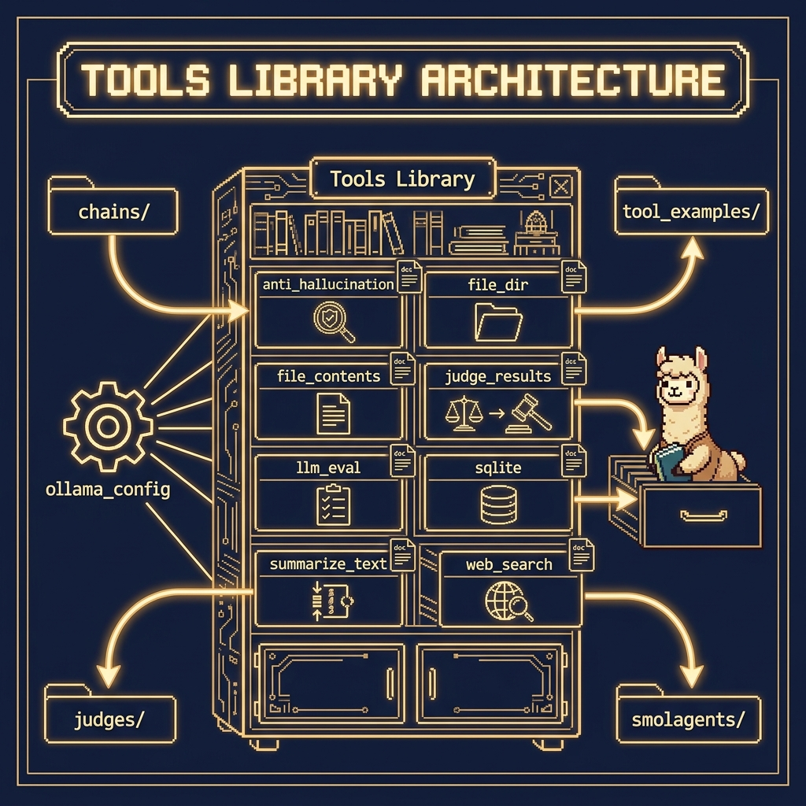

# Tools Library

**Book:** *Ollama in Action* — available free to read online at [https://leanpub.com/ollama/read](https://leanpub.com/ollama/read)

**Book Chapter:** [LLM Tool Calling with Ollama](https://leanpub.com/read/ollama/llm-tool-calling-with-ollama)

This directory contains **reusable tool implementations** shared across multiple book examples. Each tool is a Python function decorated with docstrings that serve as the tool's schema description for Ollama's function-calling API.

## Available Tools

| Module | Function | Description |
|---|---|---|
| `tool_anti_hallucination.py` | `detect_hallucination` | Checks LLM output for potential hallucinations |
| `tool_file_dir.py` | `list_directory` | Lists files and directories in the current working directory |
| `tool_file_contents.py` | `read_file_contents`, `write_file_contents` | Reads or writes text files |
| `tool_judge_results.py` | `judge_results` | Uses an LLM to evaluate correctness of another LLM's output |
| `tool_llm_eval.py` | `evaluate_llm_conversation` | Evaluates the quality of a full LLM conversation |
| `tool_sqlite.py` | `SQLiteTool`, `OllamaFunctionCaller` | SQLite database tool with Ollama-powered natural-language queries |
| `tool_summarize_text.py` | `summarize_text` | Summarizes a block of text using Ollama |
| `tool_web_search.py` | `uri_to_markdown` | Fetches a web page and converts it to Markdown |

## Architecture



## Usage

These tools are imported by other examples (e.g., `chains/`, `tool_examples/`, `judges/`, `smolagents/`). They are not run directly.

```python
from tools.tool_file_contents import read_file_contents
from tools.tool_summarize_text import summarize_text
```

## Copyright and License

Copyright 2024-2026 Mark Watson. All rights reserved.
